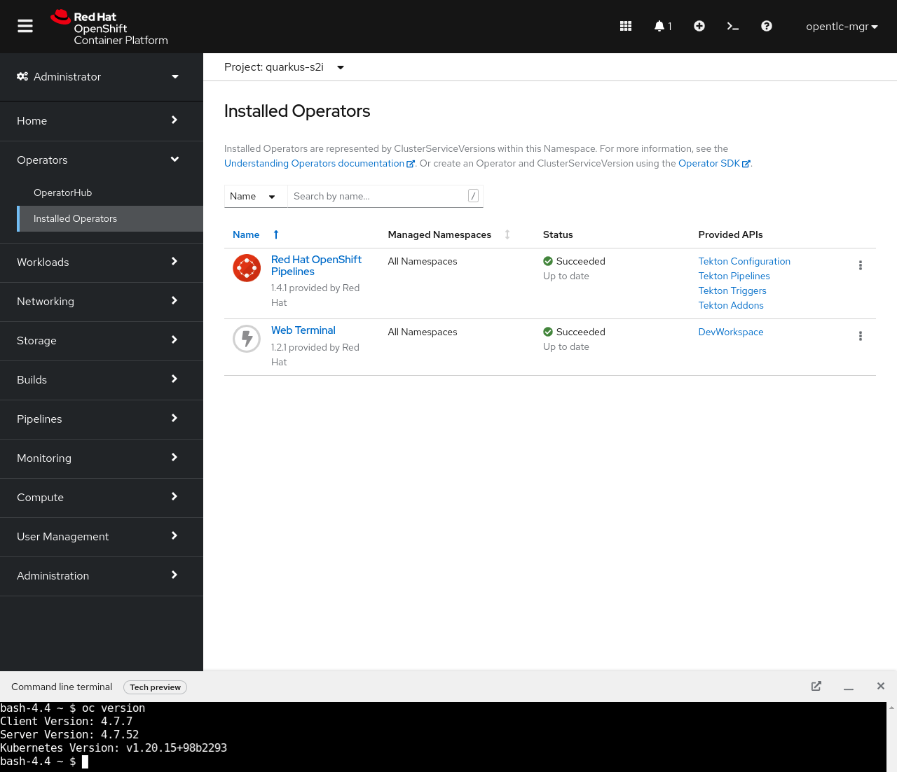
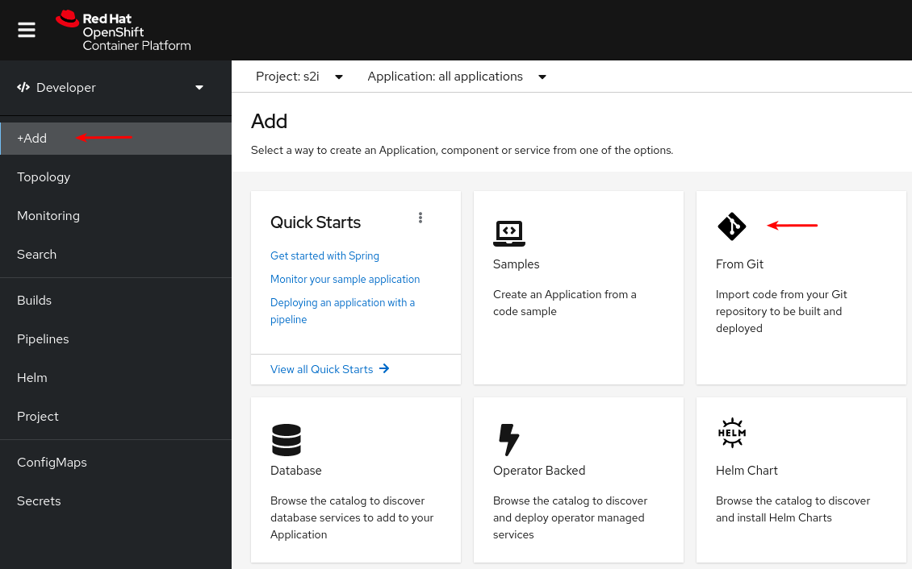
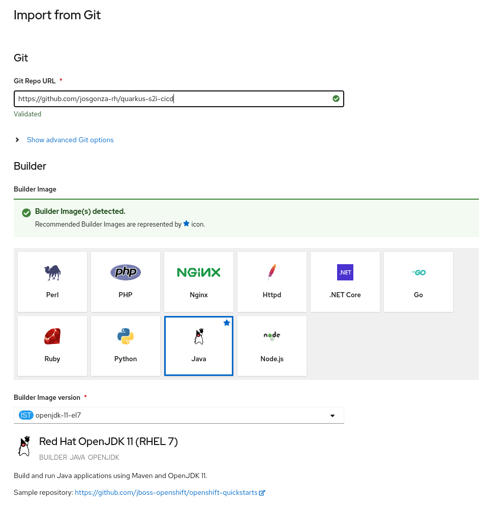
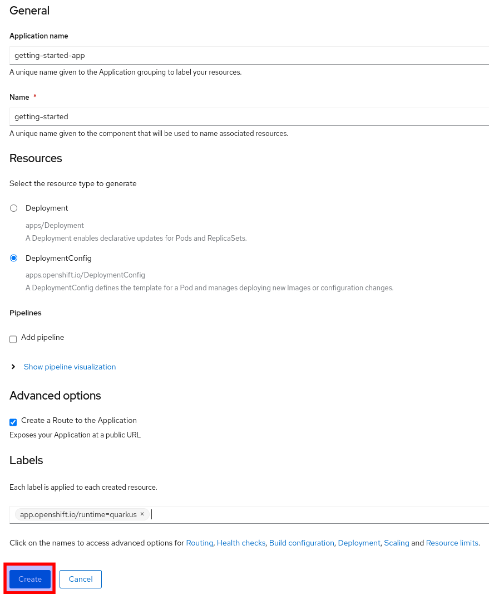
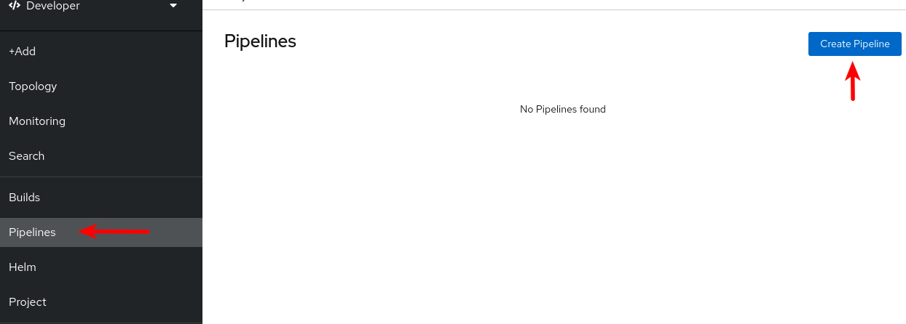
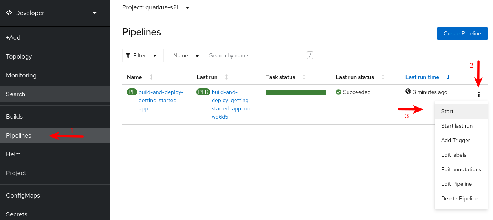
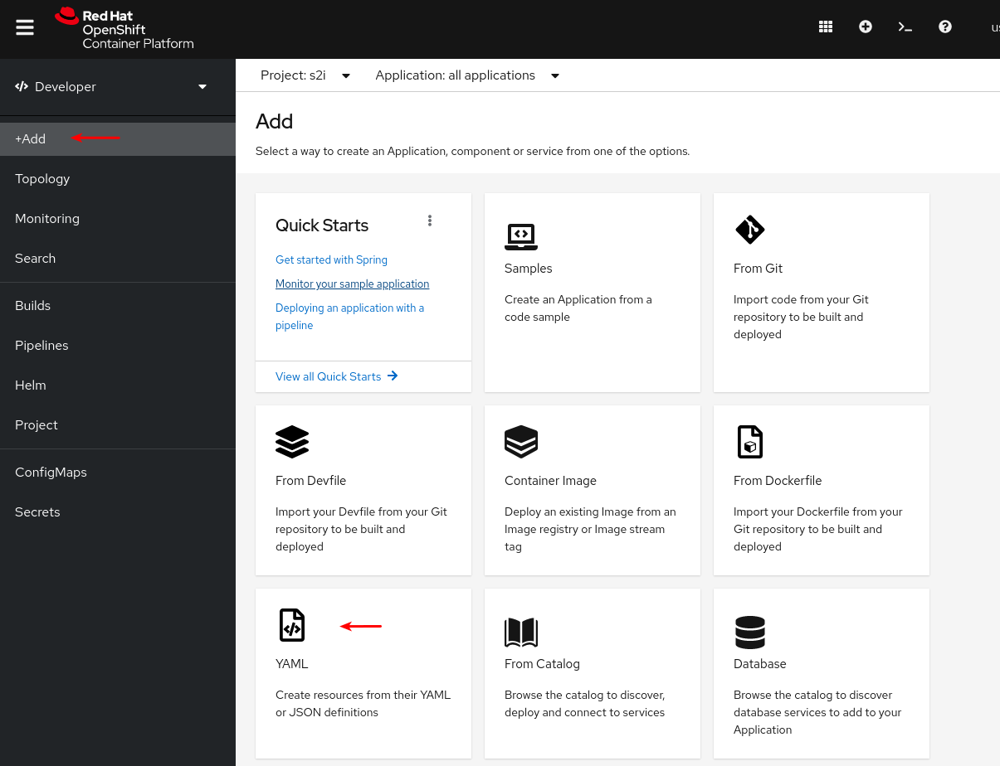
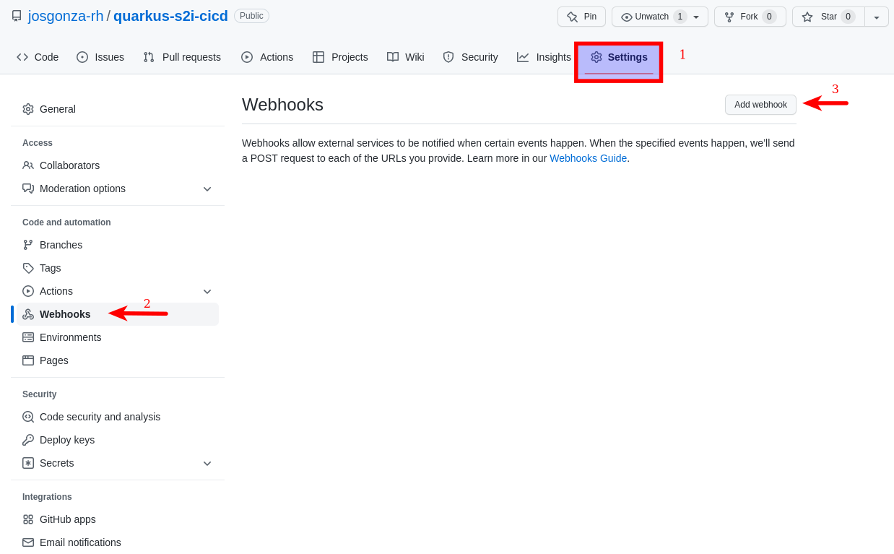
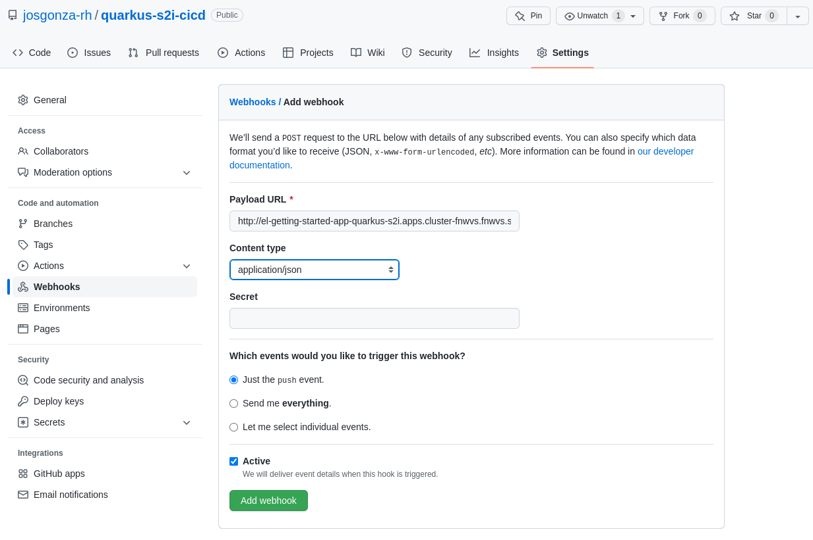
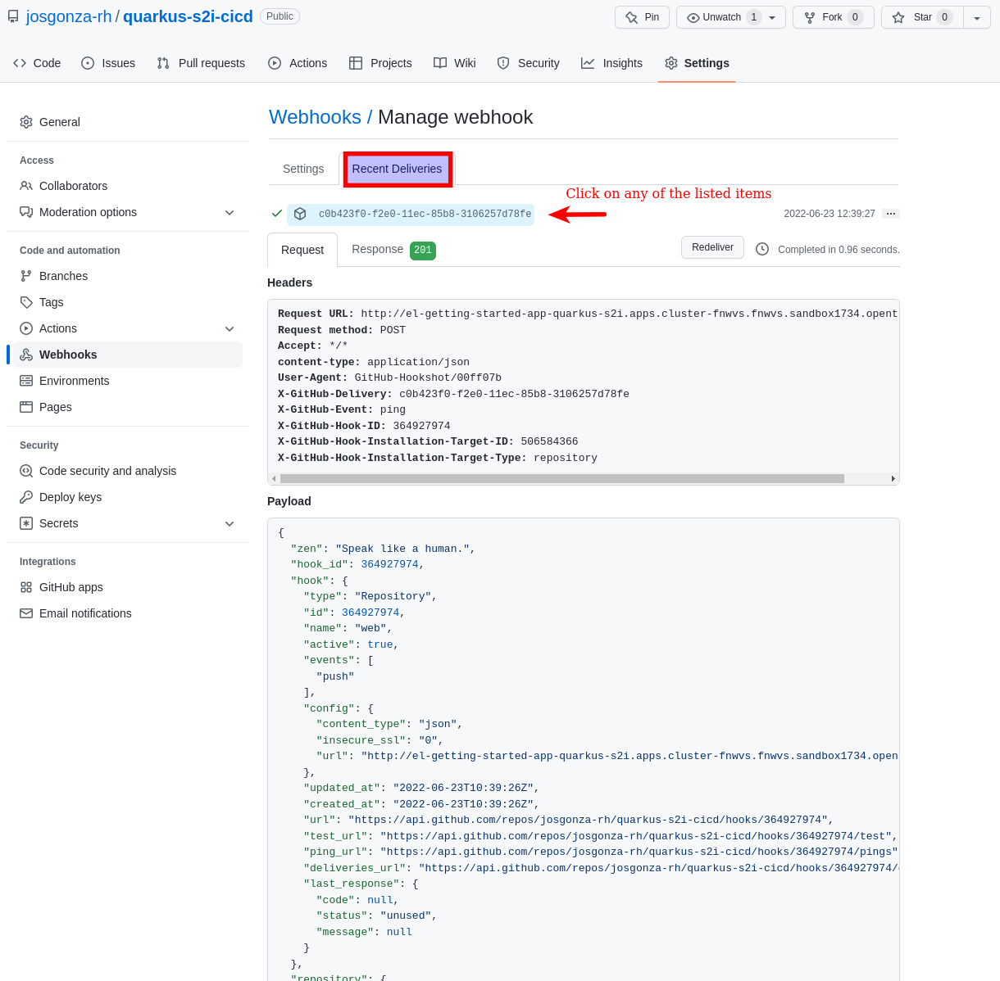

# quarkus-s2i-cicd
[Quarkus](https://quarkus.io/) getting-started app for Red Hat OpenShift S2I using [CI/CD](https://cloud.redhat.com/learn/topics/ci-cd) ([Red Hat OpenShift Pipelines](https://docs.openshift.com/container-platform/latest/cicd/pipelines/understanding-openshift-pipelines.html)).

## Prerequisites

* You have access to an OpenShift Container Platform cluster (4.7.x).

* You have installed OpenShift Pipelines (1.4.x) using the Red Hat OpenShift Pipelines Operator listed in the OpenShift OperatorHub. Once installed, it is applicable to the entire cluster.

* You have installed OpenShift Pipelines CLI (or use the terminal offered by the `Web Terminal` operator)

  

* (Optional) You have forked this Git repository using your GitHub ID, and have administrator access to that repository (just for testing the Webhook part)

## Step-by-step guide

### Initial deployment

1. Create the project with the web console or from command line, ex. `quarkus-s2i`:

    ```bash
    oc new-project quarkus-s2i
    ```

2. Deploy the initial app:

    * Using web consle ( `+Add` -> `From Git` ) with this repo: https://github.com/josgonza-rh/quarkus-s2i-cicd

      

      

      

      >  **WARNING**: `Name` is crucial here. You **must** set it to as **getting-started** as you can see in the sreenshot. If you want to change the `Name` to another value, you should change the `deployment-name` value in for the [TriggerTemplate](cicd/resources/02-triggers/getting-started-trigger.yaml).

    * From command line:

        ```bash
        oc new-app ubi8/openjdk-11~https://github.com/josgonza-rh/quarkus-s2i-cicd --name=getting-started
        ```

3. Create Pipeline

    * Using web consle ( `+Add` -> `YAML` ) or the Pipeline menu:

      

    * From command line:

        ```bash
        oc create -f https://raw.githubusercontent.com/josgonza-rh/quarkus-s2i-cicd/main/resources/01-pipelines/getting-started-pipeline.yaml
        ```

4. Running the Pipeline

    * From command line:

        ```bash
        tkn pipeline start build-and-deploy-getting-started-app -w name=workspace,volumeClaimTemplateFile=https://raw.githubusercontent.com/josgonza-rh/quarkus-s2i-cicd/main/resources/00-worspaces/getting-started-workspace.yaml -p GIT_REPO=https://github.com/josgonza-rh/quarkus-s2i-cicd
        ```

    * Using web consle ( `Pipeline` -> `Start` )

      

    >  **NOTE**: A `PipelineRun` resource starts a pipeline and ties it to the Git and image resources that should be used for the specific invocation. It automatically creates and starts the `TaskRun` resources for each task in the pipeline.

### Triggers and Webhook

Triggers enable pipelines to respond to external GitHub events, such as push events and pull requests. After you assemble and start a pipeline for the application, add the `TriggerBinding`, `TriggerTemplate`, `Trigger`, and `EventListener` resources to capture the GitHub events.

>  **NOTE**: you must execute all of the following commands within the namespace in wich you want to deploy the CI/CD stuff (**quarkus-s2i** in this example).

1. Adding triggers to the pipeline

    * Using web consle ( `+Add` -> `YAML` )

      

    * From command line:

        ```bash
        oc create -f https://raw.githubusercontent.com/josgonza-rh/quarkus-s2i-cicd/main/resources/02-triggers/getting-started-trigger.yaml
        ```

2. Expose the `EventListener` service as an OpenShift Container Platform route to make it publicly accessible:

    ```bash
    oc expose svc el-getting-started-app
    ```

>  **NOTE**: Adding webhooks requires administrative privileges to the repository. If you do not have administrative access to your repository, contact your system administrator for adding webhooks.

1. Get the webhook URL:

    ```bash
    echo "URL: $(oc  get route el-getting-started-app --template='http://{{.spec.host}}')"
    ```

2. Configure webhook manually on your repository:

    * Open the repositoryin your browser.
    * Click **Settings** → **Webhooks** → **Add Webhook**

        

    * On the Webhooks/Add Webhook page:
        * Enter the webhook URL from step 1 in Payload URL field
        * Select **application/json** for the Content type
        * Ensure that the **Just the push event** is selected
        * Select **Active**
        * Click **Add Webhook**

      

Finally, you can check the `webhook` integration by click in on it, and then, in the **Recent Deliveries** tab:


